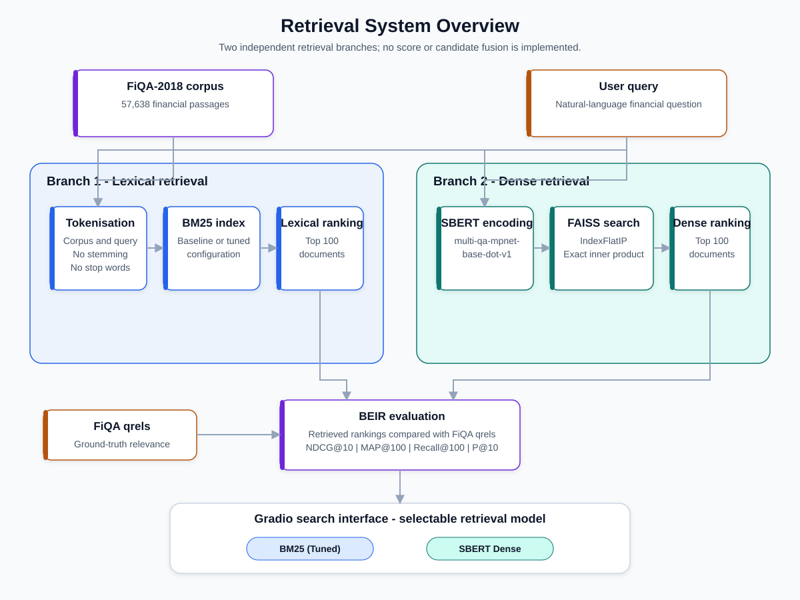
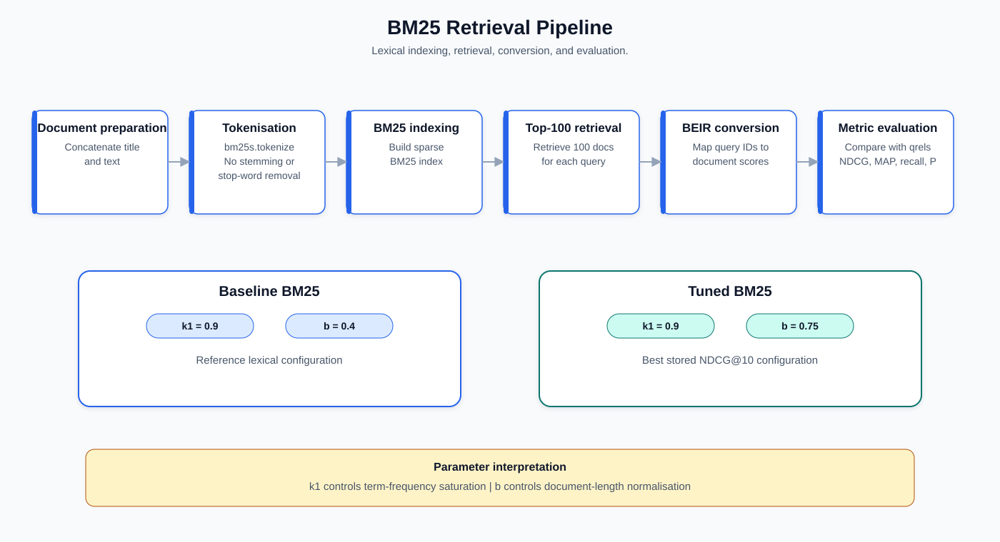
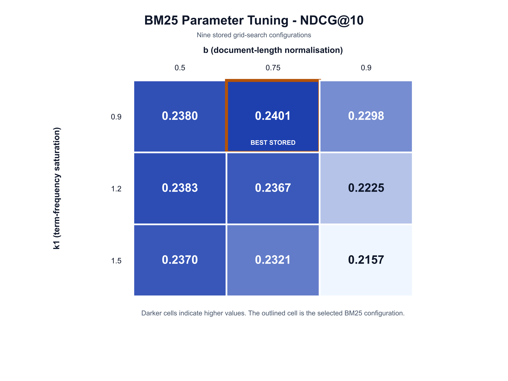
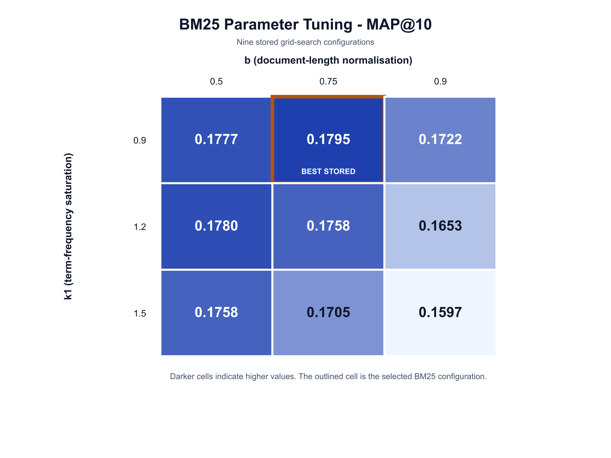
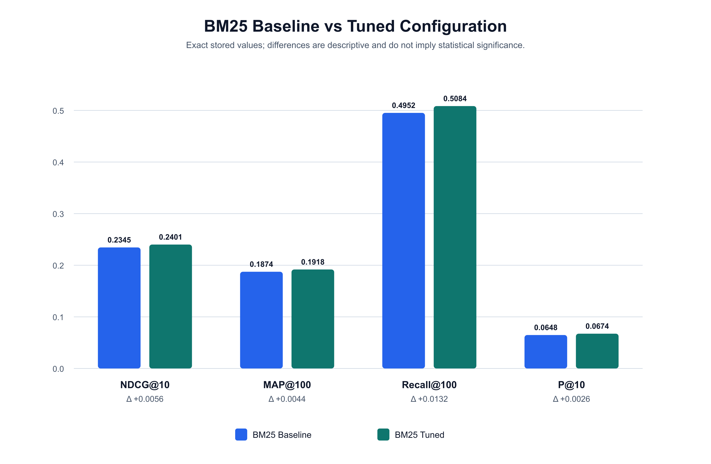
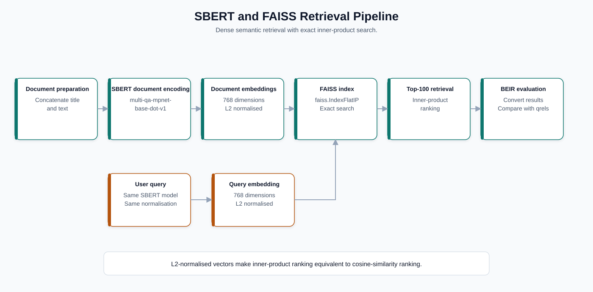
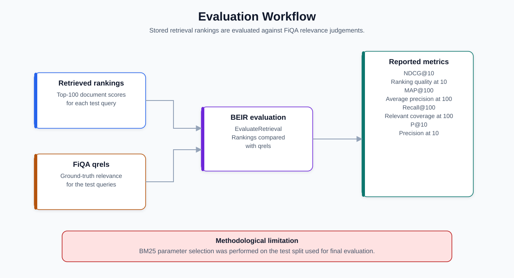
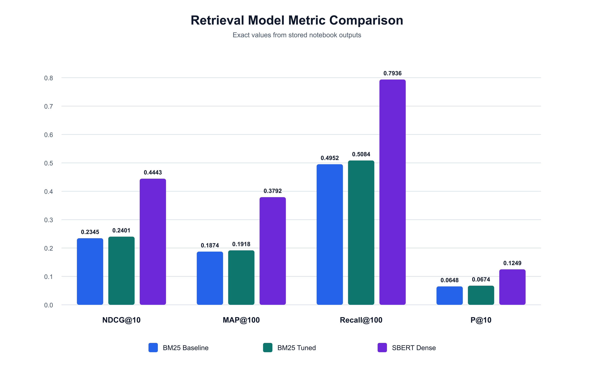

# Financial Information Retrieval with BM25 and SBERT

An information retrieval system for financial question answering, evaluated on the BEIR FiQA-2018 benchmark. The project compares a lexical BM25 baseline, an optimised BM25 configuration, and dense semantic retrieval using Sentence-BERT with exact FAISS search.

The complete implementation, stored outputs, evaluation workflow, and interactive Gradio interface are available in [`notebooks/fiqa_search_engine.ipynb`](notebooks/fiqa_search_engine.ipynb).

## Project Information

**Project type:** University group project

**Team size:** 4

**My role:**

- Designed the evaluation methodology.
- Defined the experimental framework.
- Performed BM25 parameter tuning analysis.
- Analysed retrieval performance.
- Interpreted and documented the results.
- Coordinated project milestones.

The team built the complete retrieval system described in this repository, including the BM25 and dense-retrieval pipelines, FAISS indexing, evaluation workflow, and Gradio interface. The role listed above identifies my personal contribution within that shared work.

This project was completed as part of a four-person university group. My primary contribution focused on evaluation design, experimental methodology, BM25 parameter tuning analysis, results interpretation, and project coordination.



## Key Features

- Lexical retrieval over 57,638 financial passages using BM25.
- Grid search over nine BM25 parameter combinations.
- Dense question-to-passage retrieval with `multi-qa-mpnet-base-dot-v1`.
- Exact inner-product vector search with `faiss.IndexFlatIP`.
- Evaluation using NDCG@10, MAP@100, Recall@100, and P@10.
- Interactive model selection and search through Gradio.
- Reproducible result tables and publication-ready diagrams and figures.

## Repository Structure

```text
information-retrieval/
├── assets/
│   ├── diagrams/       # Retrieval and evaluation workflows
│   ├── figures/        # Result comparisons and tuning heatmaps
│   └── screenshots/    # Reserved for interface screenshots
├── data/
│   └── README.md       # Dataset acquisition note
├── notebooks/
│   └── fiqa_search_engine.ipynb
├── reports/
│   └── presentation.pdf
├── results/
│   ├── bm25_tuning_grid.csv
│   └── model_comparison.csv
├── LICENSE
├── README.md
└── requirements.txt
```

## Dataset (BEIR FiQA-2018)

FiQA-2018 is a financial question-answering dataset standardised within the BEIR benchmark. It contains natural-language financial questions and answer passages collected from financial community platforms, making it useful for testing retrieval when queries and relevant documents use different vocabulary.

The notebook downloads the public BEIR archive at runtime and loads the test split through `GenericDataLoader`. The dataset is deliberately not stored in this repository.

| Component | Scope used in the notebook |
|---|---:|
| Corpus | 57,638 documents |
| Test queries | 648 queries |
| Test qrels | 648 query entries with relevance mappings |

See [`data/README.md`](data/README.md) for the repository's dataset policy.

## Retrieval Pipeline

The corpus is prepared by concatenating each document's title and text. A user query can then be processed independently by either of two retrieval branches:

1. **Lexical retrieval:** tokenisation, BM25 indexing, and BM25 ranking.
2. **Dense retrieval:** SBERT encoding, exact FAISS inner-product search, and semantic ranking.

Both branches retrieve the top 100 documents per query and are evaluated independently against FiQA qrels. They are compared but not fused; the project does not implement a hybrid retrieval model.

## BM25 Parameter Optimisation

The BM25 pipeline tokenises the prepared documents and queries without stemming or stop-word removal, builds a sparse index, retrieves the top 100 documents for each query, converts the rankings to BEIR format, and evaluates them against the qrels.



The baseline uses `k1=0.9` and `b=0.4`. Parameter optimisation evaluates:

- `k1 ∈ {0.9, 1.2, 1.5}`, controlling term-frequency saturation.
- `b ∈ {0.5, 0.75, 0.9}`, controlling document-length normalisation.

| k1 | b | NDCG@10 | MAP@10 |
|---:|---:|---:|---:|
| **0.9** | **0.75** | **0.2401** | **0.1795** |
| 1.2 | 0.50 | 0.2383 | 0.1780 |
| 0.9 | 0.50 | 0.2380 | 0.1777 |
| 1.5 | 0.50 | 0.2370 | 0.1758 |
| 1.2 | 0.75 | 0.2367 | 0.1758 |
| 1.5 | 0.75 | 0.2321 | 0.1705 |
| 0.9 | 0.90 | 0.2298 | 0.1722 |
| 1.2 | 0.90 | 0.2225 | 0.1653 |
| 1.5 | 0.90 | 0.2157 | 0.1597 |

The best stored configuration is `k1=0.9`, `b=0.75`, selected by NDCG@10. It applies stronger document-length normalisation than the baseline while retaining the same term-frequency saturation setting.

| NDCG@10 tuning grid | MAP@10 tuning grid |
|---|---|
|  |  |



The full tuning grid is available in [`results/bm25_tuning_grid.csv`](results/bm25_tuning_grid.csv).

## Dense Retrieval with SBERT and FAISS

Dense retrieval uses the pretrained Sentence Transformers model `multi-qa-mpnet-base-dot-v1`, selected for asymmetric question-to-passage retrieval. Documents and queries are encoded into 768-dimensional, L2-normalised vectors.

The document vectors are indexed with `faiss.IndexFlatIP`. Because the embeddings are normalised, inner-product ranking is equivalent to cosine-similarity ranking. `IndexFlatIP` performs exact rather than approximate search and returns the top 100 documents for each test query.



SBERT outperformed BM25 because dense embeddings can match semantically related financial questions and passages even when they do not share the same terms. This addresses the vocabulary mismatch between conversational questions and answer passages containing more specialised financial language.

## Evaluation Methodology

Each retrieval run is converted to BEIR's query-to-document score format and evaluated against the FiQA test qrels.

| Metric | Interpretation |
|---|---|
| NDCG@10 | Ranking quality within the first ten results, rewarding relevant documents placed higher. |
| MAP@100 | Mean average precision through rank 100. |
| Recall@100 | Fraction of relevant documents recovered within the first 100 results. |
| P@10 | Fraction of the first ten results that are relevant. |



## Results

| Model | k1 | b | NDCG@10 | MAP@100 | Recall@100 | P@10 |
|---|---:|---:|---:|---:|---:|---:|
| BM25 Baseline | 0.9 | 0.40 | 0.2345 | 0.1874 | 0.4952 | 0.0648 |
| BM25 Tuned | 0.9 | 0.75 | 0.2401 | 0.1918 | 0.5084 | 0.0674 |
| **SBERT Dense** | — | — | **0.4443** | **0.3792** | **0.7936** | **0.1249** |



BM25 optimisation produced small but consistent gains across the four reported metrics. NDCG@10 increased from 0.2345 to 0.2401, an absolute improvement of 0.0056. SBERT Dense achieved the strongest stored result on every metric, including NDCG@10 of 0.4443 and Recall@100 of 0.7936.

The machine-readable comparison is available in [`results/model_comparison.csv`](results/model_comparison.csv).

## Interactive Search Interface

The notebook defines a Gradio interface for searching the FiQA corpus with either **BM25 (Tuned)** or **SBERT Dense**. It provides:

- A free-text query input.
- A selectable retrieval model.
- A Top-K control from 1 to 20.
- Ranked results containing document ID, score, title, and text snippet.
- Example financial queries for both retrieval modes.

The `gradio.live` URL stored in the notebook output was temporary and is no longer expected to function. Running the interface cell in a compatible environment creates a new session.

## Technologies

- Python
- BEIR
- BM25 / `bm25s`
- Sentence Transformers
- FAISS
- PyTorch
- pandas
- Gradio

## Limitations

- BM25 parameter selection and final evaluation use the same test split, which may overestimate generalisation performance.
- BM25 and SBERT are evaluated independently; no hybrid score or candidate fusion is implemented.
- SBERT is used as a pretrained model without FiQA-specific fine-tuning.
- Indexing and query latency are not benchmarked systematically.
- Metric differences are not accompanied by statistical significance testing or confidence intervals.

## Future Work

- Tune retrieval parameters on a dedicated validation split.
- Combine lexical and dense retrieval through score or candidate fusion.
- Add a reranking stage over the highest-ranked candidates.
- Benchmark indexing time, memory consumption, and query latency.
- Persist BM25 and FAISS indexes for faster application startup.
- Pin dependency versions and model revisions for stronger reproducibility.

## Reports

The accompanying project presentation provides a concise overview of the objective, dataset, retrieval models, evaluation metrics, and results:

- [`reports/presentation.pdf`](reports/presentation.pdf)

## Project Attribution

This repository documents work completed by a four-person university project team. Aaron Gulzar's personal contribution is described in the project information section above.
